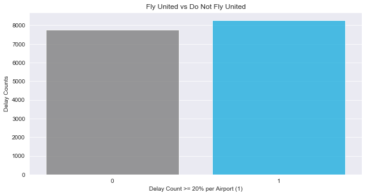
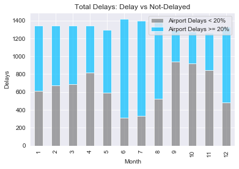
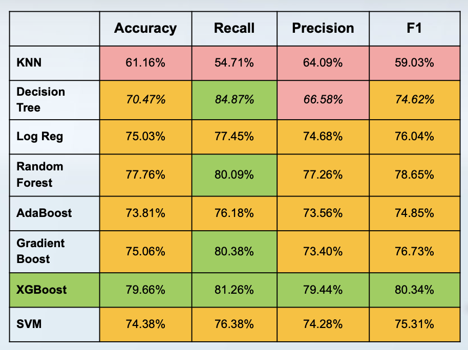
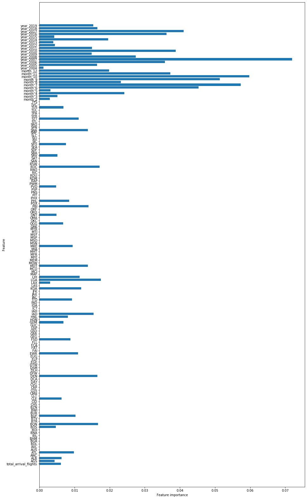

# airline_classifcationproject

# Mod_5 Classification project 

***Presentation:*** 
https://docs.google.com/presentation/d/1C3j3M1RD1broGEBP-hSPHpQul_8n4n7t/edit#slide=id.p1

**Question**
Can we predict if a flight will be delayed?
(The US department of transportation defines a delayed flight as 15 minutes or more past the departure scheduled time.)

**Data Cleaning** 
Target: Delayed_Flight >= 20%
- Dataset originally had number of flights delayed per month/year for each airport
Features: Months, years, total arrival flights, airports
- Removed flight delay minutes from data set as well as %delays

Remove observations with missing data
Rename columns name
Created Dummy variables
- Month 
- Year
- Airport
Scaled data for better performance of models

Note: There was high correlation between the minute features and target variable which can cause issues to the modeling process. (minute delay columns dropped)

**Evaluation Data Analysis**
My target variable is somewhat evenly distributed as you can see in the image below. (no need to smote)

You can clearly see that there are differences between months with delayed flights. 

**Model Evaluation**

As you can see XGBoost preformed the best out of all models. 

**XGBoost Statistical Measures**
Accuracy: 79.66% 
(highest model)

F1-Score: 80.34%
(highest model)

Precision Score: 79.44% 
(highest model)

Recall Score: 81.26 
(Sensitivity/TPR) 

AUC: 80%
Specificity: 77.98%
FPR: 22.02%

**XGBoost Feature Importances:**
